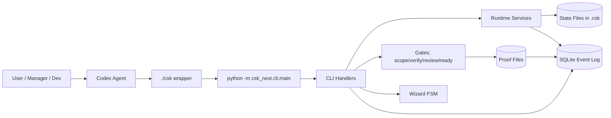
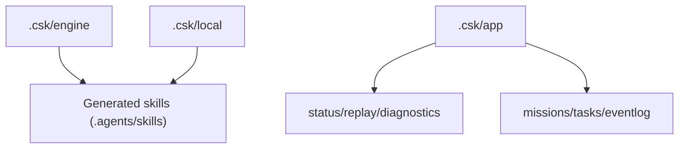
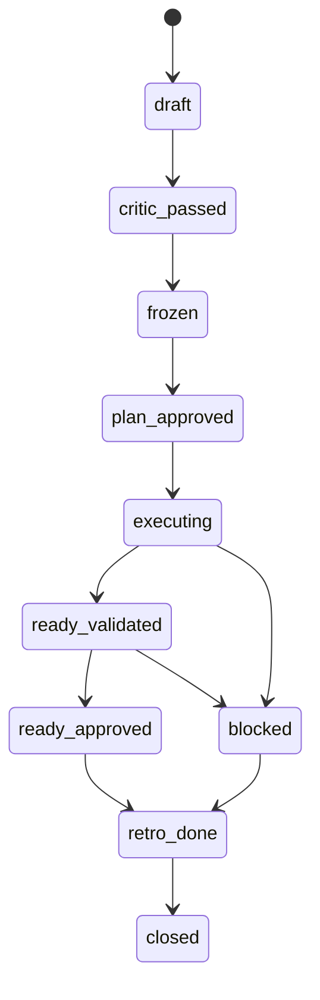
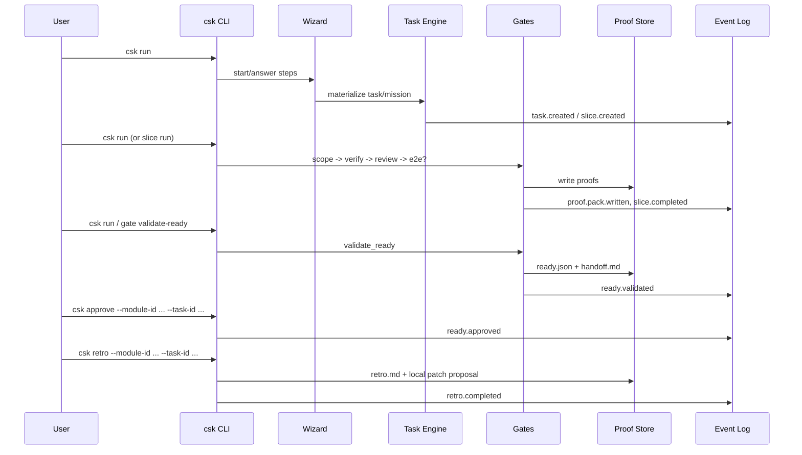

# Полное описание проекта CSK-Next

Версия документа: 2026-02-26  
Проект: `hestia_code_assistant`  
Engine version: `0.1.0`

## 1. Что это за проект

CSK-Next — это workflow-движок для управляемой разработки через фазы, гейты и доказательства (proofs).  
Он не просто запускает команды, а ведёт задачу через формальный жизненный цикл:

`draft -> critic_passed -> frozen -> plan_approved -> executing -> ready_validated -> ready_approved -> retro_done -> closed`

Ключевая идея: сделать разработку воспроизводимой и проверяемой за счёт:
- жёстких переходов состояния,
- append-only event log,
- proof-артефактов по гейтам,
- обязательной ретроспективы,
- детерминированного `NEXT` в CLI.

## 2. Какая проблема решается

CSK-Next решает типичные сбои инженерного процесса:
- изменения уходят в обход плана и скоупа;
- нет формальных доказательств, что проверка реально проходила;
- сложно восстановить, почему задача оказалась в текущем состоянии;
- обновления tooling ломают локальные кастомизации;
- разработка в multi-module репозиториях теряет контроль границ.

## 3. North Star UX

Основной UX-подход:
- вход через короткий `csk` (или `./csk`);
- пользователь получает `SUMMARY / STATUS / NEXT`;
- система подсказывает один безопасный следующий шаг;
- пользовательские команды: `csk`, `csk new`, `csk run`, `csk approve`, `csk module <id>`, `csk retro`, `csk replay --check`.

## 4. Архитектура (верхний уровень)



## 5. Слои хранения состояния

В проекте используется 3-слойная модель:



- `.csk/engine`: поставляемый engine pack (templates, skills_src, schemas, VERSION).
- `.csk/local`: локальные override (profiles, skills_override, hooks, patches, config).
- `.csk/app`: рабочее состояние (registry, missions, backlog, eventlog).
- `.agents/skills`: сгенерированные навыки (engine + local overlay).

## 6. Карта ключевых артефактов

| Путь | Назначение |
|---|---|
| `.csk/app/registry.json` | Реестр модулей |
| `.csk/app/eventlog.sqlite` | SSOT event log |
| `.csk/app/missions/M-*/` | Миссии, routing, milestones, worktrees |
| `.csk/modules/<module>/tasks/T-*/task.json` | Состояние задачи |
| `.csk/modules/<module>/tasks/T-*/plan.md` | План |
| `.csk/modules/<module>/tasks/T-*/slices.json` | Слайсы и требования гейтов |
| `.csk/modules/<module>/tasks/T-*/freeze.json` | Freeze-хэши плана |
| `.csk/modules/<module>/tasks/T-*/approvals/*.json` | Human approvals (plan/ready/user_check) |
| `.csk/modules/<module>/run/tasks/T-*/proofs/**` | Proofs по гейтам и READY |
| `.csk/modules/<module>/tasks/T-*/retro.md` | Retro-отчёт задачи |
| `.csk/local/patches/*.md` | Рекомендованные локальные улучшения после retro |

## 7. Доменные сущности

- `Module`: зарегистрированный scope разработки (`module_id`, `path`, `initialized`).
- `Mission`: набор работ по нескольким модулям.
- `Task`: единица выполнения внутри модуля.
- `Slice`: минимальный исполняемый кусок task.
- `Gate`: формальная проверка (scope, verify, review, ready).
- `Proof`: артефакт, доказывающий прохождение gate.
- `Incident`: формализованный сбой с remediation.

## 8. Жизненный цикл Task



Недопустимые переходы блокируются (`ensure_task_transition`).

## 9. Как работает CLI (внутри)

`cli/main.py` для каждого вызова делает:
1. Парсинг и user-friendly alias rewrite (`module <id>` -> `module status --module-id <id>`, `retro` -> `retro run`).
2. `command.started` event в SQLite.
3. Вызов handler.
4. `command.completed` event с `exit_code` и `result_status`.
5. Вывод:
- интерактивно: текстовый `SUMMARY/STATUS/NEXT`,
- машинно: JSON.

## 10. Псевдокод: корневой роутинг и NEXT

```text
function project_root_status(layout):
  bootstrapped = engine_exists && local_exists && registry_exists
  if !bootstrapped:
    next = "csk bootstrap"
    return status(next)

  modules = project_module_projections()
  skills = validate_generated_skills()
  if skills != ok:
    next = "csk skills generate"
    return status(next)

  if any module.phase == PLAN_FROZEN:
    next = "csk task approve-plan ..."
  else if any module.phase == PLANNING:
    next = "csk task critic|freeze ..."
  else if any module.phase == EXECUTING:
    next = "csk slice run ..."
  else if any module.phase == READY_VALIDATED:
    next = "csk gate approve-ready ..."
  else if any module.phase in {RETRO_REQUIRED, BLOCKED}:
    next = "csk retro run ..."
  else:
    next = "csk run"

  return status(next)
```

## 11. Псевдокод: bootstrap

```text
function bootstrap(layout):
  ensure_engine_from_bundled_pack()
  ensure_local_defaults(config, profiles, hooks)
  ensure_app_dirs_and_registry()
  ensure_root_agents_policy()
  generate_skills(engine.skills_src + local.skills_override -> .agents/skills)
  if registry empty:
    registry_detect()
  return ok
```

## 12. Псевдокод: csk run

```text
function cmd_run(args):
  if no scripted args:
    status = project_root_status()
    if exists EXECUTING module with active task:
      if all slices done:
        return gate_validate_ready()
      return slice_run(active_slice)
    if stdin is TTY:
      return run_wizard_interactive()
    return wizard_start()
  else:
    return run_wizard_scripted(args)
```

`csk run` в `IDLE` не является no-op: он ведёт в wizard flow.

## 13. Wizard flow

Шаги wizard:
1. `intake_request`
2. `module_mapping` (`module_id:path`, без autodetect)
3. `execution_shape` (`single|multi|auto`)
4. `planning_option` (`A|B|C`)
5. `confirm_materialization` (`yes|no`)

Артефакты wizard:
- `.csk/app/wizards/W-####/session.json`
- `.csk/app/wizards/W-####/events.jsonl`
- `.csk/app/wizards/W-####/result.json`

## 14. Псевдокод: slice execution loop

```text
function execute_slice(...):
  if task.status == blocked: return blocked
  ensure task executable and plan approved
  ensure freeze hashes still valid (no drift)
  ensure dependencies of slice done
  enforce max_attempts policy

  run implement command (optional)
  snapshot before/after -> changed_files

  scope_proof = check_scope(changed_files, allowed_paths)
  if required scope and failed: fail_slice(kind=scope_violation)

  verify_proof = run_verify(parsed_verify_commands, command_policy)
  if required verify and failed: fail_slice(kind=verify_fail)

  review_proof = record_review(p0..p3)
  if required review and failed: fail_slice(kind=review_fail)

  if e2e required by slice/profile:
    run e2e commands
    if fail: fail_slice(kind=e2e_fail)

  write proof_pack + manifest
  mark slice done
  emit events: proof.pack.written, slice.completed
  return done
```

## 15. READY gate и handoff

READY (`gates/ready.py`) проверяет:
- freeze валиден,
- plan approval существует,
- для всех required gates есть passed proofs,
- verify покрытие > 0 команд,
- e2e passed если обязателен,
- `user_check` если profile требует.

При успехе:
- пишется `proofs/ready.json`,
- генерируется `proofs/READY/handoff.md`,
- task может перейти в `ready_validated`,
- затем `approve-ready` переводит в `ready_approved`.

## 16. Retro

Retro допускается только из `ready_approved` или `blocked`:
- формируется `retro.md` (кластеры инцидентов),
- создаётся local patch proposal в `.csk/local/patches`,
- task -> `retro_done`,
- пишется `retro.completed` event.

## 17. Event sourcing и replay

SQLite event log (`eventlog.sqlite`) хранит envelope:
- `id`, `ts`, `type`, `actor`,
- `mission/module/task/slice ids`,
- `payload_json`, `artifact_refs_json`,
- `repo_git_head`, `engine_version`.

`replay --check` проверяет инварианты по событиям:
- для `proof.pack.written` существует manifest,
- для `ready.approved` существует ready proof,
- для `retro.completed` существует retro file.

При нарушениях: статус `replay_failed`, exit code `30`.

## 18. Диаграмма E2E выполнения



## 19. Update engine и overlay-модель

`update engine` делает:
1. backup текущего `.csk/engine`,
2. замена engine на bundled pack,
3. regenerate skills,
4. strict validate,
5. rollback + incident при ошибке.

Важно:
- `.csk/local` сохраняется,
- generated skills не редактируются вручную,
- source-of-truth для overrides: `.csk/local/skills_override` и `.csk/local/profiles`.

## 20. Команды и поверхности API

User-facing (основные):
- `csk` / `csk status --json`
- `csk new "..."`
- `csk run`
- `csk approve ...`
- `csk module <id>`
- `csk retro --module-id ... --task-id ...`
- `csk replay --check`

Backend/операционные:
- `task/*`, `slice/*`, `gate/*`, `event/*`, `incident/*`, `wizard/*`, `validate`, `doctor`, `update`, `migrate-state`, `context build`, `pkm build`.

## 21. Безопасность и guardrails

- Verify запрещает pipelines (`|`) и поддерживает allowlist/denylist.
- По умолчанию denylist содержит `rm`, `sudo`, `curl`, `wget`.
- `doctor run --git-boundary` контролирует запретные пути для коммита (`.csk`, `.agents`, `AGENTS.md` и др.).
- Любой gate failure формирует incident + следы в task/local журналах.

## 22. Проверки перед push (обязательные)

```bash
./csk validate --all --strict --skills
./csk replay --check
./csk doctor run --git-boundary
```

## 23. Ограничения текущей версии

- В v1 replay проверяет ограниченный набор инвариантов (manifest/ready/retro existence).
- Wizard опирается на явный module mapping (без автодетекта в шаге mapping).
- Полнота Context/PKM зависит от уже накопленных verify/event данных.

## 24. Где смотреть реализацию

- CLI: `engine/python/csk_next/cli/*`
- Runtime: `engine/python/csk_next/runtime/*`
- Gates: `engine/python/csk_next/gates/*`
- Event Log: `engine/python/csk_next/eventlog/store.py`
- Wizard: `engine/python/csk_next/wizard/*`
- Skills generator: `engine/python/csk_next/skills/generator.py`
- Engine update: `engine/python/csk_next/update/engine.py`
- Acceptance tests: `engine/python/tests/test_acceptance.py`

## 25. Краткий итог

CSK-Next — это не просто CLI, а stateful orchestration system для инженерного workflow с формальными гейтами, доказательствами, инцидентами и воспроизводимостью через event log + replay.
