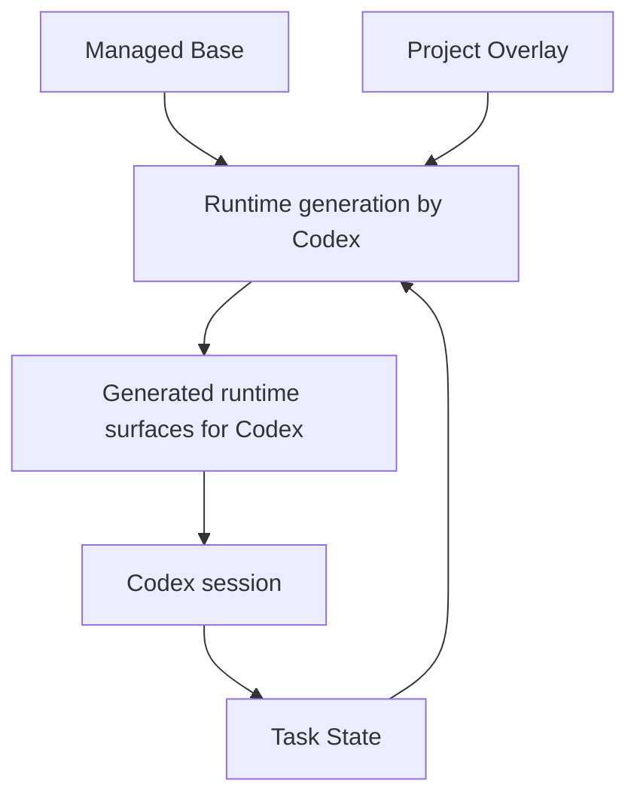
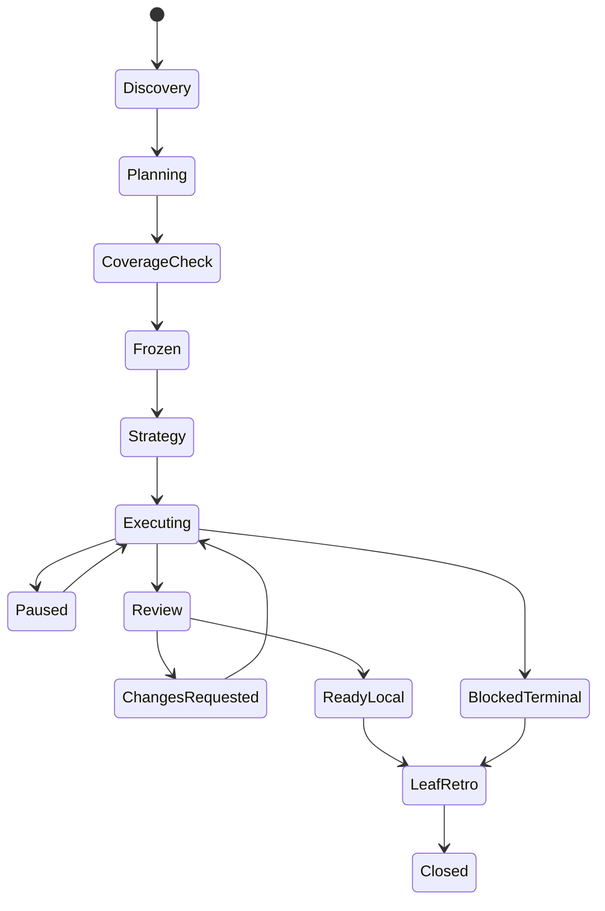
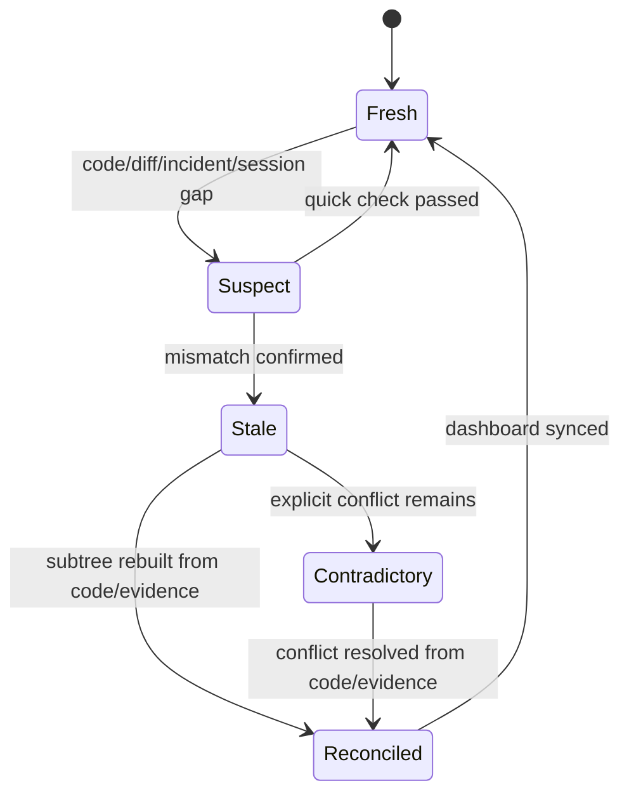

# CSK vNext — финальная спецификация workflow под Codex
Статус: final implementation spec  
Язык документа: русский  
Цель документа: дать разработчику достаточную спецификацию для реализации нового CSK без дополнительной устной расшифровки.

---

## 1. Краткое определение

**CSK vNext** — это workflow-layer над Codex для долгой инженерной работы, где:
- задача сначала проходит совместное планирование с разработчиком;
- работа раскладывается по дереву модулей;
- подробное планирование делается только на текущем уровне и детально только для текущего leaf;
- весь прогресс, решения, проблемы, evidence и retro хранятся в текстовых артефактах внутри проекта;
- runtime-файлы для Codex (`AGENTS.md`, локальные guide-файлы, часть skills/reference-файлов) **генерируются** из канонического состояния CSK;
- в core **нет обязательного Python runtime** и нет отдельного автоматического валидатора ответов модели;
- все действия выполняет сам Codex через инструкции, skills, структуру файлов и, при необходимости, простые helper scripts.

---

## 2. Что именно должен решать CSK

### 2.1 Основные проблемы, которые должен решить CSK
1. Codex слишком быстро переходит к coding без достаточного совместного planning.
2. На длинных задачах контекст раздувается, качество деградирует, появляются дублирование и drift.
3. Пользователь теряет понимание: какие файлы меняются, почему, в каком порядке, какие риски.
4. Планирование часто не покрывает все поверхности изменения.
5. После паузы трудно продолжить работу без потери контекста.
6. После ошибок и friction-поинтов workflow не улучшается автоматически на уровне проекта.
7. Разным проектам нужен один костяк workflow, но с разной кастомизацией.

### 2.2 Что считается успехом
CSK считается работающим правильно, если:
- сложная задача почти всегда сначала раскладывается по модульному дереву;
- пользователь может в любой момент увидеть текущее состояние workflow и следующий рекомендованный шаг;
- у каждого активного leaf есть понятный локальный план, состояние, docs delta, evidence и retro;
- можно продолжить задачу в новой сессии, не полагаясь только на память модели;
- project-owned кастомизация переживает update managed base;
- runtime для Codex генерируется из канонического состояния, а не редактируется вручную.

---

## 3. Что CSK **не** делает

1. Не запускает swarm из параллельных ассистентов как обязательную часть core.
2. Не внедряет жёсткий внешний orchestrator/runtime на Python.
3. Не валидирует ответы модели внешней программой как источник истины.
4. Не привязывает понятие “модуль” к одному языку или одной технологии.
5. Не требует, чтобы весь проект заранее был идеально разбит на модули.
6. Не обещает математически доказать, что planning покрыл вообще всё; вместо этого он требует формализованный coverage sweep на каждом уровне.

---

## 4. Базовые принципы

### 4.1 Planning-first
Код нельзя писать, пока текущий уровень planning не завершён и не заморожен (`frozen`).

### 4.2 Recursive planning
Планирование идёт по уровням дерева:
- root-level;
- internal-module level;
- leaf-level.

Подробное file-level planning делается **только на текущем leaf**.

### 4.3 One active branch
В рамках одной задачи активно исполняется только одна ветка дерева за раз. Параллельность не является core-требованием.

### 4.4 Text-native state
Всё состояние хранится в текстовых файлах, которые читает и обновляет Codex.

### 4.5 Generated runtime
`AGENTS.md`, локальные guidance-файлы и часть doc/review surfaces не редактируются руками; они генерируются из `.csk/project/**`.

### 4.6 Human-visible understanding
Workflow должен помогать пользователю понимать, что происходит:
- какие модули затронуты;
- какие файлы затронуты;
- какие контракты меняются;
- какие docs надо обновить;
- какой следующий шаг.

### 4.7 Retro as workflow mutation
Любой повторяющийся friction должен иметь путь в overlay/templates/skills/base-improvement.

### 4.8 State freshness before progress
Работу нельзя продолжать только потому, что текстовый state “выглядит правдоподобно”. Перед descent, execution, READY, integration и final review текущий state должен быть либо `fresh`, либо пройти reconciliation. Если code/diff/evidence противоречат state, приоритет у code/diff/evidence; state должен быть переписан на минимально затронутом поддереве.

---

## 5. Ключевые сущности

### 5.1 Global Root
Верхний уровень проекта. Хранит:
- дерево верхнеуровневых модулей;
- глобальные инварианты;
- root-level route plan;
- общую задачу;
- сводный статус;
- integration/final review.

### 5.2 Local Root
Любой внутренний узел дерева модулей. Например: `tasks`, `auth`, `billing`.  
Local root:
- владеет своим поддеревом;
- умеет раскладывать задачу по детям;
- хранит локальные решения, contracts и coverage для своего уровня;
- не обязан знать детали всех leaf-ов.

### 5.3 Module
Логическая bounded responsibility внутри проекта.  
Модуль не обязан совпадать с package/service/folder, но должен иметь:
- purpose;
- owned paths;
- children or leaf nature;
- contracts;
- invariants;
- docs;
- verification surface.

### 5.4 Leaf
Минимальный модуль, внутри которого можно детально планировать конкретные изменения и выполнять кодовую работу.

### 5.5 Change Packet
Временная единица работы по конкретной задаче внутри модуля или leaf-а.

### 5.6 Decision Card
Артефакт для важного выбора:
- вопрос;
- варианты;
- рекомендация;
- риски;
- решение пользователя/команды;
- статус.

### 5.7 Coverage Ledger
Артефакт полноты planning на текущем уровне.

### 5.8 Incident
Любая проблема или friction-point, возникшие при работе:
- сбой команды;
- непонятность для пользователя;
- неясная граница модуля;
- missing docs;
- missing environment prerequisite;
- verification gap;
- review gap;
- planning gap.

### 5.9 Evidence Bundle
Набор доказательств, что leaf/module прошёл свои обязательные шаги:
- какие команды запускались;
- что получилось;
- что проверено;
- какие риски остались;
- какие docs обновлены.

### 5.10 Retro Item
Результат retro, который надо поднять в:
- project overlay;
- templates;
- skill;
- module policy;
- managed base suggestion.

---

## 6. Архитектурные слои CSK



### 6.1 Managed Base
Обновляемый vendor-managed skeleton workflow.

### 6.2 Project Overlay
Project-owned кастомизация. Никогда не должна быть без спроса перезаписана обновлением base.

### 6.3 Task State
Живое состояние задач, планов, incidents, evidence, retro.

### 6.4 Generated Runtime
Производные файлы для Codex:
- root `AGENTS.md`;
- nested `AGENTS.md`;
- review stubs;
- docs stubs;
- skill references;
- generated manifests.

---

## 7. Файловая структура

Ниже каноническая файловая структура для установленного workflow-layer.

```text
repo/
  .csk/
    base/
      workflow.yaml
      templates/
      skills/
      planning/
      review/
      docs/
    project/
      workflow.yaml
      module-tree.yaml
      planning-policy.yaml
      review-policy.yaml
      retro-policy.yaml
      docs-policy.yaml
      modules/
        tasks.yaml
        tasks.sync.yaml
        tasks.policy.yaml
        auth.yaml
      templates/
      skills/
        custom/
      freeform/
        root-extra.md
        modules/
          tasks.sync.md
    state/
      dashboard.yaml
      tasks/
        T-142/
          task.yaml
          root-plan.md
          root-coverage.yaml
          decision-log.md
          incidents.md
          evidence.md
          final-review.md
          retro-summary.md
          modules/
            tasks/
              state.yaml
              level-plan.md
              coverage.yaml
              decisions.md
              incidents.md
              evidence.md
            tasks.sync/
              state.yaml
              leaf-plan.md
              coverage.yaml
              decisions.md
              incidents.md
              evidence.md
              retro.md
            tasks.policy/
              state.yaml
              leaf-plan.md
              coverage.yaml
              decisions.md
              incidents.md
              evidence.md
              retro.md
    generated/
      manifest.yaml
      previews/
  .agents/
    skills/
      csk/
        SKILL.md
      csk-start-task/
        SKILL.md
      csk-level-plan/
        SKILL.md
      csk-reconcile-state/
        SKILL.md
      implementation-strategy/
        SKILL.md
      csk-leaf-work/
        SKILL.md
      code-change-verification/
        SKILL.md
      docs-sync/
        SKILL.md
      csk-leaf-retro/
        SKILL.md
      csk-sync-runtime/
        SKILL.md
  AGENTS.md
  docs/
    modules/
    plans/
    reviews/
    diagrams/
  src/
    tasks/
      AGENTS.md
      sync/
        AGENTS.md
      policy/
        AGENTS.md
```

---


## 7.1 Ограничение Codex на protected paths

В обычном режиме `workspace-write` Codex рассматривает `.agents/` и `.codex/` как защищённые read-only пути внутри writable root.  
Следствие для CSK:

- normal task flow не должен зависеть от записи в `.agents/**` или `.codex/**`;
- живая работа, state, incidents, plans, evidence и runtime-generation должны жить в обычных writable путях репозитория;
- базовые repo skills в `.agents/skills/**` считаются install/update assets, а не per-task generated artifacts;
- project custom skill drafts можно хранить в `.csk/project/skills/custom/**`, а materialization в `.agents/skills/**` делать только в explicit maintenance/install/update step, где пользователь осознанно запускает соответствующую процедуру.


## 8. Канонические файлы и их смысл

### 8.1 `.csk/project/workflow.yaml`
Главные project-owned настройки workflow:
- включённые стадии;
- правила freeze;
- правила READY;
- default behavior по planning/review/retro;
- generation policy;
- naming;
- optional doc fallback names;
- module interpretation policy.

### 8.2 `.csk/project/module-tree.yaml`
Карта модульного дерева проекта.

### 8.3 `.csk/project/modules/*.yaml`
Карточки модулей.

### 8.4 `.csk/state/dashboard.yaml`
Главный runtime state для `$csk`, включая state health, blockers, pending retro и следующий рекомендованный шаг.

### 8.5 `root-plan.md`
Маршрутизация задачи по верхнему уровню.

### 8.6 `level-plan.md`
План на уровне internal module.

### 8.7 `leaf-plan.md`
Подробный локальный план для текущего leaf.

### 8.8 `coverage.yaml`
Артефакт полноты planning на текущем уровне.

### 8.9 `incidents.md`
Журнал проблем и friction.

### 8.10 `evidence.md`
Результаты проверок, запусков, наблюдений и basis для READY/state reconciliation.

### 8.11 `retro.md`
Результат leaf retro.

### 8.12 Generated `AGENTS.md`
Короткая runtime-проекция для Codex. Не источник истины.

---

## 9. Форматы сущностей

### 9.1 Module Card (`.csk/project/modules/<module>.yaml`)

```yaml
id: tasks.sync
parent: tasks
kind: leaf
purpose: Синхронизация задач между локальным состоянием и сервером
owned_paths:
  - src/tasks/sync/**
contracts:
  provides:
    - TaskSyncService.sync()
  requires:
    - tasks.policy.ConflictPolicy
invariants:
  - sync не должен вшивать бизнес-правило разрешения конфликта
  - при конфликте sync обязан вызывать policy
verification:
  - pnpm test src/tasks/sync
  - pnpm typecheck
docs:
  - docs/modules/tasks-sync.md
children: []
tags:
  - backend
  - task-domain
```

### 9.2 Internal Module Card

```yaml
id: tasks
parent: null
kind: internal
purpose: Домен задач
owned_paths:
  - src/tasks/**
contracts:
  provides:
    - TaskDomain API
  requires: []
invariants:
  - дочерние подмодули задач не должны дублировать CRUD-логику
verification:
  - pnpm test src/tasks
docs:
  - docs/modules/tasks.md
children:
  - tasks.crud
  - tasks.sync
  - tasks.policy
  - tasks.api
```

### 9.3 Task file (`task.yaml`)

```yaml
id: T-142
title: Новый conflict-resolution flow для offline sync задач
status: active
owner_path:
  - tasks
root_stage: root_planning
created_at: 2026-03-24
non_goals:
  - не менять UI задач
  - не менять unrelated CRUD
constraints:
  - сохранить backward compatibility существующего payload, если это возможно
done_when:
  - новый sync flow работает по согласованному policy
  - tests и docs обновлены
```

### 9.4 Module state (`state.yaml`)

```yaml
module: tasks.sync
task: T-142
kind: leaf
status: ready-for-execution
planning_status: frozen
execution_status: not_started
review_status: not_started
retro_status: pending
state_health: fresh
reconciliation_required: false
reconciliation_reason: null
state_owner_skill: csk-level-plan
last_state_update:
  at: 2026-03-24T14:20:00Z
  by_skill: csk-level-plan
  session: current
last_code_observation:
  at: 2026-03-24T14:18:00Z
  basis:
    - git status reviewed
    - expected files reviewed
  code_matches_state: true
current_packet: P-2
parent: tasks
open_questions:
  - D-4: fallback priority rule
blockers: []
incidents_open:
  - I-12
docs_pending: true
evidence_pending: true
next_recommended_skill: implementation-strategy
next_recommended_dir: src/tasks/sync
next_recommended_prompt: "Turn the frozen leaf plan into an ordered implementation strategy for tasks.sync packet P-2"
```

### 9.5 Dashboard (`dashboard.yaml`)

```yaml
active_task: T-142
current_stage: module_descent
state_health: fresh
reconciliation_required: false
stale_nodes: []
active_path:
  - tasks
  - sync
open_modules:
  - tasks
open_leafs:
  - tasks.policy
  - tasks.sync
completed_leafs: []
blockers:
  - tasks.sync: waiting on tasks.policy contract
pending_retro:
  - tasks.sync
next_recommended_skill: csk-level-plan
next_recommended_target: tasks.policy
next_recommended_dir: src/tasks/policy
next_recommended_prompt: "Plan the next level for tasks.policy"
```

### 9.6 Change Packet

```yaml
id: P-2
task: T-142
module: tasks.sync
kind: leaf_change
goal: Внедрить новый conflict resolution flow в sync
depends_on:
  - P-1
expected_files:
  - src/tasks/sync/service.ts
  - src/tasks/sync/conflict_flow.ts
out_of_scope:
  - src/tasks/ui/**
  - src/tasks/crud/**
contract_delta:
  - SyncResult.resolution_source
docs_delta:
  - docs/modules/tasks-sync.md
checks:
  - pnpm test src/tasks/sync
  - pnpm typecheck
status: planned
```

### 9.7 Decision Card (markdown)
```md
# D-4 — conflict priority fallback

## Question
Кто владеет финальным правилом при конфликте sync?

## Options
A. sync service
B. tasks.policy
C. root-level shared utility

## Recommendation
B

## Why
- бизнес-правило не должно жить в transport/sync слое
- легче менять без переписывания sync
- меньше риск дублирования

## Risks
- появляется новая зависимость sync -> policy

## Developer decision
B

## Status
decided
```

### 9.8 Incident entry
```md
## I-12
Type: command_failure
Stage: leaf_execution
Status: open
When: after running local tests
What happened:
`pnpm test src/tasks/sync` failed because LOCAL_API_URL was not set.

Immediate handling:
Execution paused. Verification marked blocked.

Potential fix:
Add environment prerequisites to leaf plan template and module docs.

Needs retro:
yes
```

---

## 10. Статусы, state machine и здоровье state

### 10.1 Task statuses
- `new`
- `intake`
- `root_planning`
- `module_descent`
- `leaf_execution`
- `integration_review`
- `final_review`
- `done`
- `blocked`

### 10.2 Module planning statuses
- `not_started`
- `in_discovery`
- `in_planning`
- `coverage_check`
- `frozen`
- `replan_required`

### 10.3 Execution statuses
- `not_started`
- `executing`
- `paused`
- `blocked`
- `ready-local`

### 10.4 Review statuses
- `not_started`
- `in_review`
- `changes_requested`
- `ready-reviewed`

### 10.5 Retro statuses
- `pending`
- `in_retro`
- `promoted`
- `closed`

### 10.6 State health statuses
- `fresh` — state проверен в текущей реальности кода и годится для продолжения.
- `suspect` — есть признаки, что state может быть неполным или устаревшим; нужна локальная сверка.
- `stale` — state точно не отражает текущий код/проверки/следующий шаг и должен быть обновлён.
- `contradictory` — state прямо конфликтует с кодом, diff, evidence или child/parent статусами.
- `reconciled` — state только что был пересобран из code/diff/evidence в текущей сессии; после синхронизации dashboard может вернуться в `fresh`.

### 10.7 Leaf lifecycle


### 10.8 State reconciliation lifecycle


### 10.9 Базовое правило переходов
- Нельзя переходить к execution, review, integration или final review, если текущий dashboard/state узла имеет `state_health` = `stale` или `contradictory`.
- При `suspect` разрешена только быстрая сверка; если mismatch подтвердился, узел переводится в `stale`.
- При `reconciled` текущая сессия обязана обновить dashboard и next step, иначе `fresh` не ставится.

---
## 11. Полный lifecycle workflow

## 11.1 Install
Цель: установить managed skeleton и подготовить project overlay.

Результат:
- `.csk/base/**`
- `.csk/project/**` bootstrap
- `.csk/state/**` bootstrap
- `.agents/skills/**` bootstrap
- root `AGENTS.md` draft/generated

### Требования
- install не должен копировать весь source repo в проект;
- install должен ставить только installable workflow layer;
- install должен разделять managed и project-owned части.

---

## 11.2 Init / Adopt
Цель: подготовить workflow для:
- нового проекта;
- уже существующего проекта.

Результат:
- первичный `module-tree.yaml`;
- стартовые module cards;
- root-level docs/templates;
- правила project overlay;
- initial runtime generation.

### Adopt-specific
При adopt надо:
- считать текущую структуру проекта;
- предложить стартовое модульное дерево;
- отметить неизвестные или спорные зоны;
- не пытаться сразу “идеально” смоделировать весь проект.

---

## 11.3 Runtime sync
Цель: сгенерировать runtime-surfaces для Codex из канона.

Запускается:
- после install/init/adopt;
- после изменения overlay;
- после retro, если retro изменил workflow;
- после update managed base.

Результат:
- root `AGENTS.md`;
- nested `AGENTS.md`;
- review docs;
- doc stubs;
- generated manifests.

### Важно
Это **процедура**, а не отдельный обязательный Python-компилятор.  
Она должна быть реализуема самим Codex через skill `$csk-sync-runtime`.

`$csk-sync-runtime` обновляет только runtime-surfaces. Он не должен молча переписывать `.csk/state/**`, кроме технических метаданных генерации.

---

## 11.4 Новая задача — intake
Цель: принять новую задачу и не дать Codex сразу уйти в coding.

### Вход
Пользователь описывает задачу в свободной форме.

### Действия
1. Активируется `$csk`.
2. Если `dashboard.yaml` или активная задача не `fresh`, сначала обязателен `$csk-reconcile-state`.
3. Активируется `$csk-start-task`.
4. Codex создаёт `task.yaml`.
5. Сессия переходит в planning posture.
6. До freeze действует read-only режим.

### Обязательные выходы intake
- brief;
- constraints;
- non_goals;
- done_when;
- initial decision cards;
- root planning needed = yes/no.

---

## 11.5 Root planning
Цель: разложить задачу по модулям первого уровня.

### Root planning отвечает на вопросы
- какие 1st-level modules затронуты;
- какие не затронуты и почему;
- где проходят contract edges;
- нужен ли новый верхнеуровневый модуль;
- в каком порядке спускаться ниже.

### Root planning **не** делает
- точный file map для всех leaf-ов;
- детальный план кодирования во всех ветках;
- полный implementation plan на весь repo.

### Root outputs
- `root-plan.md`
- `root-coverage.yaml`
- decision cards верхнего уровня
- child packets 1-го уровня
- обновлённый dashboard

---

## 11.6 Level planning
Цель: на уровне internal module разложить задачу по детям.

### Internal level planning отвечает на вопросы
- какие дочерние модули затронуты;
- какие дочерние модули не затронуты;
- меняются ли local contracts;
- нужно ли создавать новый child module;
- нужно ли спускаться ниже;
- есть ли blockers для descent.

### Level planning outputs
- `level-plan.md`
- `coverage.yaml`
- decisions
- child packets следующего уровня
- updated state

### Важно
На этом уровне планирование среднедетальное.  
Не надо делать полный file-by-file design для всех потомков.

---

## 11.7 Leaf planning
Цель: подготовить **конкретный** leaf к выполнению.

### Leaf plan обязан содержать
- purpose;
- goal;
- files in scope;
- files out of scope;
- contract delta;
- local invariants;
- environment prerequisites;
- checks/tests;
- docs delta;
- risks;
- acceptance;
- exact next edit sequence.

### Дополнительное правило
Если leaf нетривиальный (новая логика, межмодульный контракт, миграционный риск, несколько файлов, высокий шанс drift), после freeze leaf обязан пройти через `$implementation-strategy` до первого edit. Этот skill превращает frozen leaf plan в ordered strategy, checkpoints, edge cases и verification cadence.

### Leaf plan outputs
- `leaf-plan.md`
- `coverage.yaml`
- decisions
- `state.yaml` со статусом `frozen / ready-for-execution`

---

## 11.8 Leaf execution
Цель: выполнить одну leaf-ветку.

### Правила
1. Один active leaf за раз.
2. Работать маленькими slices.
3. После важного slice запускать relevant check.
4. Если scope drift — остановиться и поднять `replan_required`.
5. Любой incident писать сразу в `incidents.md`.
6. После каждого material slice обновлять текущий `state.yaml`.
7. Перед завершением сессии обязательно обновить:
   - `state.yaml`
   - `dashboard.yaml`, если изменился next step
   - `incidents.md`, если был friction
   - `evidence.md`, если уже есть полезные результаты
8. Если сессия прервалась до обязательного state update, текущий узел должен считаться как минимум `suspect`; при явном рассинхроне — `stale`.
9. Если `state_health` не `fresh`/`reconciled`, execution продолжать нельзя; сначала `$csk-reconcile-state`.

### Что leaf execution не должен делать
- молча расширять scope;
- перепрыгивать в соседние несогласованные модули;
- менять runtime guidance руками.

---

## 11.9 Local review
Цель: проверить leaf до локальной готовности.

### Минимальный стек
- `$code-change-verification`
- relevant tests/checks из leaf plan;
- ручной просмотр diff пользователем;
- `/review` в Codex;
- сверка с local review policy;
- `$docs-sync`, если есть `docs_delta`, `contract_delta`, `diagram_required` или `docs_pending = true`;
- фиксация evidence.

### Правило state
`ready-local` нельзя ставить, пока:
- `evidence.md` не обновлён;
- docs obligations не закрыты или явно не помечены как N/A;
- `state.yaml` и `dashboard.yaml` не отражают реальный следующий шаг;
- `state_health` не `fresh`.

### Выход
`ready-local`, `changes_requested` или `blocked-terminal`.

---

## 11.10 Leaf retro
Цель: после завершения leaf или terminal block разобрать проблемы и предложить фиксы workflow.

### Leaf retro запускается всегда, когда leaf переходит в:
- `ready-local`, или
- `blocked-terminal`.

### Leaf retro входные данные
- `incidents.md`
- `decisions.md`
- `leaf-plan.md`
- `evidence.md`
- замечания пользователя

### Leaf retro outputs
- `retro.md`
- список promotion targets
- updated overlay/templates/skills proposal
- updated retro queue status
- обновлённые `state.yaml` и `dashboard.yaml` с закрытием retro queue для leaf

### Важно
Leaf нельзя считать полностью закрытым, пока retro либо не завершён, либо явно не помечен как deferred с причиной. По умолчанию retro обязателен.

---

## 11.11 Parent integration
Цель: когда дочерние leaf-ы закрыты, parent/local root проверяет:
- сошлись ли контракты;
- не противоречат ли решения;
- нет ли gaps в local docs;
- пройдена ли нужная integration surface на уровне parent.

Выход:
- `ready-parent`, или
- `replan_required`, или
- `changes_requested`.

---

## 11.12 Final review
Цель: завершить задачу целиком.

### Проверяется
- все child packets закрыты;
- integration review завершён;
- docs обновлены;
- evidence bundle есть;
- unresolved risks либо закрыты, либо зафиксированы;
- root retro summary собран.

### Выход
- `done`
- `final-review.md`
- `retro-summary.md`

---

## 12. Planning: подробная спецификация

## 12.1 Главный принцип
Planning в CSK — это **главный продукт**, а не “короткий пролог перед codegen”.

## 12.2 Planning posture
При любой новой или существенно изменившейся задаче:
- сначала включается planning posture;
- до freeze текущего уровня запрещено coding;
- по умолчанию рекомендуется read-only;
- planning начинается с `$csk`, а если state не `fresh` — с `$csk-reconcile-state`;
- root/internal planning выполняется через `$csk-level-plan`;
- нетривиальный frozen leaf до первого edit проходит через `$implementation-strategy`.

## 12.3 Уровни planning

| Уровень | Назначение | Детализация |
|---|---|---|
| Root | Разложить задачу по top-level modules | Низко-средняя |
| Internal module | Разложить по детям | Средняя |
| Leaf | Подготовить конкретное исполнение | Высокая |

## 12.4 Completeness sweep на каждом уровне

### Root/Internal sweep
Проверить:
1. Какие дети рассмотрены.
2. Какие дети затронуты.
3. Какие явно не затронуты.
4. Какие contracts пересекаются.
5. Нужен ли новый child module.
6. Нужны ли diagrams.
7. Есть ли open questions.
8. Есть ли environment/setup unknowns.
9. Есть ли docs impact.
10. Есть ли integration impact.

### Leaf sweep
Проверить:
1. Behavior change.
2. Contract delta.
3. File map.
4. Invariants.
5. Tests/checks.
6. Docs delta.
7. Environment prerequisites.
8. Edge cases.
9. Risks/rollback.
10. Evidence plan.

### Правило полноты
План на уровне считается достаточным, если каждый обязательный пункт:
- покрыт, или
- помечен `n/a`, или
- помечен `deferred`, или
- помечен `accepted risk`.

---

## 12.5 Decision cards
Любой значимый выбор должен жить не в неструктурированном тексте, а в Decision Card.

### Обязательные поля Decision Card
- ID
- Question
- Options
- Recommendation
- Why
- Risks
- Developer decision
- Status

### Статусы
- `open`
- `decided`
- `needs_spike`
- `deferred`
- `out_of_scope`

---

## 12.6 Диаграммы
Диаграммы не обязательны всегда, но обязательны по policy trigger.

### Default triggers для diagrams
- создаётся новый модуль;
- меняется межмодульный контракт;
- меняется flow в нескольких модулях;
- меняется state lifecycle;
- leaf меняет больше одного контракта.

### Разрешённые типы
- module tree
- contract map
- sequence diagram
- state diagram
- file impact diagram

### Формат
Предпочтительно text-native:
- Mermaid
- PlantUML
- Graphviz
(конкретный формат определяется project overlay)

---

## 12.7 Freeze rule
Пока текущий уровень не получил `planning_status: frozen`, запрещено:
- начинать execution;
- ставить `ready-local`;
- генерировать final review;
- объявлять следующую стадию готовой.

### Условия freeze
- заполнен plan;
- заполнен coverage ledger;
- все open questions имеют статус;
- известен следующий child/leaf;
- обновлён dashboard/state.

---

## 13. Review и READY

## 13.1 READY уровни
- `ready-local` — leaf локально завершён.
- `ready-parent` — parent собрал детей и их локальная интеграция пройдена.
- `ready-final` — задача в целом завершена.

## 13.2 Что значит `ready-local`
Leaf может получить `ready-local`, если:
- execution выполнен;
- required checks пройдены или явно зафиксированы как not available;
- docs delta выполнен или зафиксирован как not needed;
- evidence собран;
- `/review` пройден;
- leaf retro выполнен или немедленно запускается вслед за `ready-local`.

## 13.3 Что значит `ready-parent`
Parent может получить `ready-parent`, если:
- все нужные дети завершены;
- contracts между ними согласованы;
- parent-level evidence собран;
- parent-level docs impact закрыт.

## 13.4 Что значит `ready-final`
Task может получить `ready-final`, если:
- закрыты нужные ветки;
- нет незакрытых blockers;
- проведён final review;
- собран final evidence;
- retro summary создан.

### Важно
READY — это workflow-state, а не абсолютное доказательство correctness.  
Поскольку у CSK нет внешнего валидатора модели, trust строится на:
- repo checks;
- evidence;
- review;
- понятности артефактов для пользователя.

---

## 14. Incident management

## 14.1 Когда писать incident
Incident должен писаться сразу, если:
- команда не выполнилась;
- окружение не готово;
- Codex пошёл в неверную сторону;
- пользователь не понял что-то важное;
- не хватило docs;
- не хватило planning;
- модульная граница оказалась неясной;
- review/checklist оказался неполным.

## 14.2 Типы incident
- `command_failure`
- `environment_gap`
- `sandbox_or_permission`
- `spec_gap`
- `planning_gap`
- `module_boundary_confusion`
- `user_understanding_gap`
- `verification_gap`
- `review_gap`
- `docs_gap`

## 14.3 Incident logging rule
Incident логируется сразу.  
Большой анализ делается потом в leaf retro.

## 14.4 Micro-retro trigger
Если один и тот же blocker повторился дважды внутри одного leaf:
- делается micro-retro сразу;
- решается, нужен ли replan;
- решается, нужен ли policy/template/skill fix.

---

## 15. Retro: подробная спецификация

## 15.1 Когда делать retro
Обязательный retro — **на leaf level**:
- после `ready-local`;
- после `blocked-terminal`.

Дополнительный root retro делается в конце задачи.

## 15.2 Что разбирает leaf retro
- incidents;
- где planning был слаб;
- где пользователь запутался;
- где docs не хватило;
- где checklists были неполными;
- где модульная граница оказалась плохой;
- какие fixes стоит поднять выше.

## 15.3 Возможные outputs
1. Update overlay policy
2. Update template
3. Update skill
4. Update module policy
5. Suggestion для managed base

## 15.4 Формат retro
```md
# Leaf Retro — tasks.sync

## Scope
Leaf: tasks.sync
Task: T-142

## Incidents reviewed
- I-12 command_failure
- I-13 user_understanding_gap

## What caused friction
- Verification prerequisites were undocumented
- Ownership of conflict policy was not clarified early enough

## Fixes
1. Add environment prerequisites section to leaf plan template
2. Extend module docs template with "How to run locally"
3. Add coverage check for ownership questions

## Promote to
- .csk/project/planning-policy.yaml
- .csk/project/templates/module-doc.md
- .csk/project/review-policy.yaml
```

---

## 16. Кастомизация

## 16.1 Общая идея
CSK должен поддерживать модель:

**managed base + project overlay + generated runtime**

### Managed base
Обновляется vendor-ом.

### Project overlay
Живёт в проекте. Настраивается пользователем/командой. Не должен ломаться при update.

### Generated runtime
Пересобирается из base + overlay.

## 16.2 Что можно кастомизировать в project overlay
- определение модуля;
- глубину planning;
- completeness sweeps;
- review policies;
- docs policies;
- diagram policies;
- skills;
- templates;
- naming;
- module boundaries;
- local invariants;
- local doc locations;
- extra workflow steps.

## 16.3 Что не должно кастомизироваться без явного осознания
- факт существования planning;
- факт leaf retro;
- принцип generated runtime;
- факт сохранения state;
- принцип evidence-based READY.

## 16.4 Update behavior
`update` должен:
1. обновить `.csk/base/**`;
2. прочитать `.csk/project/**`;
3. пересобрать runtime;
4. показать diff/report.

`update` **не должен** без явного действия пользователя перезаписывать `.csk/project/**`.

---

## 17. Runtime generation

## 17.1 Принцип
Runtime generation делает сам Codex через skill `$csk-sync-runtime`.

## 17.2 Что генерируется в normal runtime sync
- root `AGENTS.md`
- nested `AGENTS.md`
- docs stubs
- review stubs
- helper references
- generated manifest

## 17.3 Что **не** должно генерироваться в обычной task session
- `.agents/skills/**`
- `.codex/config.toml`
- любые protected-path файлы, если текущий режим Codex не допускает их запись

## 17.4 Materialization of skills
Базовые repo skills:
- ставятся install/update слоем как managed assets;
- не должны требовать постоянной перегенерации в обычной task session.

Project custom skills:
- сначала хранятся как source/draft в `.csk/project/skills/custom/**`;
- затем materialize-ятся в `.agents/skills/**` только в explicit maintenance/install/update flow.


## 17.5 Что нельзя делать
- редактировать generated files руками как основной способ поддержки;
- хранить единственный источник правил в generated `AGENTS.md`.

## 17.6 Маркер generated file
Каждый generated файл должен начинаться так:

```md
<!-- GENERATED BY CSK -->
<!-- SOURCE: .csk/project/... -->
<!-- DO NOT EDIT DIRECTLY -->
```

---

## 18. Skills: обязательный набор

## 18.1 Общая структура
Каждый skill — директория в `.agents/skills/<skill>/` с обязательным `SKILL.md`.

Scripts допустимы только как helper-утилиты и не являются core-runtime.

### Базовый принцип
CSK использует два типа skills:
1. **CSK-native skills** — описывают сам workflow.
2. **Adopted skills** — паттерны, заимствованные из готовых Codex skill-подходов и адаптированные под проект.

### Adopted skill patterns
Для MVP рекомендуется сохранить следующие имена и роли без лишнего переименования:
- `implementation-strategy`
- `code-change-verification`
- `docs-sync`

Они могут быть:
- импортированы как готовые repo-local skills;
- адаптированы под CSK;
- реализованы заново, но с тем же контрактом и назначением.

## 18.2 Обязательные skills

### 18.2.1 `$csk`
Точка входа и workflow dashboard/router.

**Назначение**
- показать текущий state;
- показать незавершённые задачи/leaf-и;
- показать blockers/incidents/pending retro;
- показать следующий рекомендуемый шаг;
- указать рекомендуемую директорию и skill;
- определить `state_health`;
- если state stale/contradictory — запретить продвижение и направить в `$csk-reconcile-state`.

**Не делает**
- не кодит;
- не делает deep planning;
- не делает review;
- не делает retro вместо пользователя.

**Пример вывода**
```text
CSK STATE

Active task:
T-142 — conflict resolution for offline task sync

Workflow stage:
module descent

State health:
stale

Why:
dashboard says next leaf is tasks.sync, but actual diff shows unfinished changes in tasks.policy and no matching state update

Allowed next step:
Run $csk-reconcile-state in src/tasks/policy

Suggested working directory:
src/tasks/policy
```

### 18.2.2 `$csk-start-task`
Создать новую задачу, провести intake, сформировать `task.yaml`, `root-plan.md` stub и dashboard update.

### 18.2.3 `$csk-level-plan`
Выполнить planning на текущем уровне:
- root или internal module;
- child routing;
- coverage sweep;
- decision cards;
- freeze текущего уровня;
- обновление `state.yaml`/`dashboard.yaml`.

### 18.2.4 `$csk-reconcile-state`
Восстановить корректный state, если он stale, contradictory или явно неполон.

**Назначение**
- определить минимально затронутое поддерево;
- перечитать code/diff/evidence/commands;
- переписать state снизу вверх только там, где это нужно;
- обновить dashboard и next step;
- перевести узел в `reconciled`, затем в `fresh`.

### 18.2.5 `$implementation-strategy`
Нетривиальный leaf после freeze и до первого edit обязан пройти через этот skill.

**Назначение**
- превратить frozen leaf plan в ordered edit strategy;
- определить checkpoints;
- выделить edge cases;
- уточнить sequence of edits и sequence of checks;
- убедиться, что plan остаётся в scope leaf.

### 18.2.6 `$csk-leaf-work`
Выполнить leaf execution по frozen leaf plan:
- идти по steps;
- логировать incidents;
- обновлять `state.yaml`;
- не выходить за scope;
- эскалировать `replan_required`, если scope drift.

### 18.2.7 `$code-change-verification`
Обязательный verification skill перед `ready-local`.

**Назначение**
- прогнать checks из leaf plan;
- обновить `evidence.md`;
- инициировать или потребовать `/review`;
- вернуть `ready-local`, `changes_requested` или `blocked-terminal`.

### 18.2.8 `$docs-sync`
Обязательный doc skill, если есть docs/diagram obligations.

**Назначение**
- обновить module docs;
- обновить docs delta;
- обновить required diagrams;
- зафиксировать, что docs часть definition of done закрыта.

### 18.2.9 `$csk-leaf-retro`
Провести retro по закрытому или terminally blocked leaf и оформить promotion targets.

### 18.2.10 `$csk-sync-runtime`
Перегенерировать runtime surfaces из `.csk/project/**`.

## 18.3 Возможные дополнительные skills
- `$test-coverage-improver`
- `$pr-draft-summary`
- `$csk-adopt-project`
- `$csk-module-bootstrap`
- `$csk-diagram-refresh`
- `$csk-root-finalize`

## 19. Примеры `SKILL.md`

## 19.1 `$csk`

```md
---
name: csk
description: Show the current CSK workflow state, unfinished work, blockers, pending retro items, state health, and the single next recommended step. Use at the start of every session and whenever the current workflow state is unclear.
---

1. Read `.csk/state/dashboard.yaml`.
2. Read the active task folder under `.csk/state/tasks/`.
3. Determine state health from:
   - dashboard
   - current module state
   - git diff / observed code reality if available in the session
   - evidence / incidents
4. Summarize:
   - active task
   - workflow stage
   - active path
   - open modules / leafs
   - blockers
   - pending retro
   - state health
   - next recommended skill
   - next recommended directory
   - next recommended prompt
5. If state health is `stale` or `contradictory`, do not allow implementation. Recommend only `$csk-reconcile-state`.
6. Do not start implementation.
```

## 19.2 `$csk-level-plan`

```md
---
name: csk-level-plan
description: Perform CSK planning for the current root or internal module level. Use when the task needs routing into child modules or when a current level has not yet been frozen.
---

1. Confirm the current task and current module path from `.csk/state/**`.
2. Refuse to continue if state health is not `fresh` or `reconciled`; recommend `$csk-reconcile-state`.
3. Stay in planning mode. Do not implement code.
4. Identify children considered, children touched, and children explicitly not touched.
5. Create or update:
   - current `level-plan.md`
   - current `coverage.yaml`
   - decision cards
   - child packets
   - `state.yaml`
   - dashboard if needed
6. Run the completeness sweep for this level.
7. Freeze the current level only if:
   - all required sweep sections are covered
   - open questions have statuses
   - the next child path is known
8. Output the exact next recommended step.
```

## 19.3 `$csk-reconcile-state`

```md
---
name: csk-reconcile-state
description: Rebuild stale or contradictory CSK state from code, diff, evidence, and the smallest affected subtree. Use whenever $csk reports stale/contradictory state or when a session was interrupted before state updates were completed.
---

1. Identify the smallest affected subtree.
2. Read:
   - current code and diff for that subtree
   - relevant `leaf-plan.md` / `level-plan.md`
   - `coverage.yaml`
   - `incidents.md`
   - `evidence.md`
   - parent and child `state.yaml` files
3. Mark affected nodes as `suspect`, then rewrite the affected state from code/evidence reality.
4. Update:
   - affected `state.yaml`
   - task `dashboard.yaml`
   - next recommended step
5. Set `state_health` to `reconciled`.
6. If dashboard and current node now agree with code/evidence, set `state_health` to `fresh`.
7. Do not implement code during reconciliation.
```

## 19.4 `$code-change-verification`

```md
---
name: code-change-verification
description: Run the verification and review workflow for the current leaf before ready-local. Use after leaf implementation and before claiming local readiness.
---

1. Read:
   - `leaf-plan.md`
   - `state.yaml`
   - `incidents.md`
   - `evidence.md`
2. Run or confirm the required checks from the leaf plan.
3. Request `/review` if code changed materially.
4. Update `evidence.md` with commands, outcomes, and unresolved risks.
5. If docs or diagrams are still pending, require `$docs-sync` before `ready-local`.
6. Update `state.yaml` with one of:
   - `ready-local`
   - `changes_requested`
   - `blocked-terminal`
7. Do not claim success without evidence.
```

## 19.5 `$csk-leaf-retro`

```md
---
name: csk-leaf-retro
description: Run mandatory retro for a completed or terminally blocked leaf. Use after ready-local or blocked-terminal.
---

1. Read:
   - `leaf-plan.md`
   - `incidents.md`
   - `decisions.md`
   - `evidence.md`
   - current `state.yaml`
2. Summarize friction points.
3. Identify workflow fixes:
   - overlay policy
   - template
   - skill
   - module policy
   - base suggestion
4. Write `retro.md`.
5. Update `state.yaml` and task-level retro queue.
6. Recommend whether runtime sync is required.
```

---
## 20. AGENTS.md generation rules

## 20.1 Root AGENTS.md должен содержать только:
- что такое CSK в этом repo;
- где лежат `.csk/project` и `.csk/state`;
- что начинать надо с `$csk`;
- когда обязателен planning;
- как определяется READY;
- где искать review/docs policies;
- какие skills обязательны.

## 20.2 Nested AGENTS.md должен содержать только:
- purpose модуля;
- owned paths;
- children;
- local invariants;
- local docs location;
- local checks;
- required local skills.

## 20.3 AGENTS.md должен быть коротким
Если guidance становится длинным:
- переносить деталь в docs/templates/references;
- оставлять в AGENTS только навигацию и правила включения.

## 20.4 Пример generated root AGENTS.md
```md
<!-- GENERATED BY CSK -->
<!-- DO NOT EDIT DIRECTLY -->

# CSK Runtime Guide

Start every session with `$csk`.

## Canonical sources
- Workflow rules: `.csk/project/workflow.yaml`
- Module tree: `.csk/project/module-tree.yaml`
- Active runtime state: `.csk/state/dashboard.yaml`

## Required workflow
- Start every session with `$csk`
- If state is stale or contradictory -> `$csk-reconcile-state`
- New or unclear task -> `$csk-start-task`
- Planning at current level -> `$csk-level-plan`
- Do not implement before current level is frozen
- Non-trivial frozen leaf before first edit -> `$implementation-strategy`
- Leaf execution -> `$csk-leaf-work`
- Before `ready-local` -> `$code-change-verification`
- If docs/diagrams changed -> `$docs-sync`
- Leaf completion or terminal block -> `$csk-leaf-retro`

## Ready policy
Never claim ready without:
- updated state
- fresh state health
- evidence
- docs delta handled
- retro handled for leaf work
```

---

## 21. Session model

## 21.1 Session start
Каждая новая сессия должна начинаться с:
1. `$csk`
2. проверки `state_health`
3. если `state_health != fresh`, то только `$csk-reconcile-state`
4. перехода в нужную директорию при необходимости
5. запуска соответствующего skill

## 21.2 Session scope
Одна сессия = одна coherent unit of work:
- root planning
- level planning
- leaf strategy
- leaf execution
- verification
- leaf retro
- reconciliation

Не надо держать один giant thread на всю историю проекта.

## 21.3 Session resume
Продолжение возможно:
- через `codex resume`
- или новой сессией + `$csk`

Состояние должно быть достаточным, чтобы новая сессия не полагалась на память старого чата. Но resume не отменяет проверку `state_health`: даже при `codex resume` текущая сессия обязана сначала убедиться, что state не устарел относительно кода.

## 21.4 Session exit obligations
Перед выходом из активной сессии текущий skill обязан:
- обновить свой `state.yaml`;
- обновить `dashboard.yaml`, если изменился next step или active path;
- записать incidents, если они были;
- записать evidence, если выполнялись проверки;
- оставить один явный next recommended step.

Если это не сделано, текущий узел должен считаться как минимум `suspect`, а при явном конфликте — `stale`.

---

## 22. State authority и reconciliation model

### 22.1 Иерархия истины
Поскольку у CSK нет внешнего валидатора и нет отдельного runtime-движка, нужно явно определить порядок доверия:

1. Код / diff / существующие файлы проекта
2. Вывод реально запущенных команд
3. `.csk/state/**`
4. Текст чата

Если state конфликтует с кодом, приоритет у кода.

### 22.2 Кто отвечает за актуальность state
State поддерживается **не “кем-то абстрактно”**, а конкретным активным skill-ом на каждом шаге.

| Артефакт | Основной владелец | Когда обязан обновляться |
|---|---|---|
| `task.yaml` | `$csk-start-task`, root finalization | при создании задачи, при закрытии задачи |
| `dashboard.yaml` | `$csk-start-task`, `$csk-level-plan`, `$csk-reconcile-state`, parent integration, final review | после создания задачи, после freeze текущего уровня, после reconciliation, после leaf completion/block, после integration/final review |
| `state.yaml` leaf/internal module | текущий активный skill (`$csk-level-plan`, `$implementation-strategy`, `$csk-leaf-work`, `$code-change-verification`, `$csk-leaf-retro`) | после freeze, после material slice, после incident, после verification, после retro, перед выходом из сессии |
| `coverage.yaml` | `$csk-level-plan`, `$implementation-strategy` | перед freeze, после replan |
| `incidents.md` | текущий активный skill, столкнувшийся с проблемой | немедленно по факту incident |
| `evidence.md` | `$code-change-verification`, `$docs-sync`, иногда `$csk-leaf-work` | после checks/review/doc sync |
| `retro.md` | `$csk-leaf-retro` | при `ready-local` или `blocked-terminal` |

### 22.3 Обязательные поля здоровья state
Минимум для `dashboard.yaml` и каждого `state.yaml`:
- `state_health`
- `reconciliation_required`
- `reconciliation_reason`
- `state_owner_skill`
- `last_state_update`
- `last_code_observation`

### 22.4 Когда state считается suspect/stale/contradictory
Триггеры `suspect`:
- сессия прервалась до обязательного state update;
- есть ручные/побочные изменения кода после последнего state update;
- next step выглядит сомнительным;
- parent/child state не синхронизированы.

Триггеры `stale`:
- изменился код, но соответствующий `state.yaml` не обновлялся;
- changed files не совпадают с packet/plan и это не отражено;
- evidence отсутствует, хотя review/checks уже были;
- dashboard указывает путь, который уже не соответствует активному поддереву.

Триггеры `contradictory`:
- state утверждает `ready-local`, но checks/review не подтверждены evidence;
- state говорит, что leaf не менялся, а diff показывает несогласованные изменения;
- parent считает ребёнка закрытым, а child state остаётся executing/blocked;
- docs marked done, но docs delta не применён и не помечен как N/A.

### 22.5 Что делать, если state не свежий
Если `state_health` = `suspect`, `stale` или `contradictory`:
- разрешено читать код, diff, state, incidents, evidence;
- разрешено запускать `$csk-reconcile-state`;
- разрешено делать минимальные диагностические команды;
- запрещено продолжать новую кодовую работу;
- запрещено ставить READY;
- запрещено закрывать leaf/final review без reconciliation.

### 22.6 Протокол reconciliation
1. Остановить продвижение по workflow.
2. Определить **минимально затронутое поддерево**.
3. Перечитать:
   - код и diff этого поддерева;
   - соответствующий plan;
   - incidents;
   - evidence;
   - child/parent states.
4. Переписать только нужные state files снизу вверх:
   - leaf `state.yaml`
   - parent `state.yaml`, если надо
   - `dashboard.yaml`
5. Записать новый next recommended step.
6. Поставить `state_health = reconciled`.
7. Если dashboard и текущий узел теперь согласованы с code/diff/evidence, перевести их в `fresh`.

### 22.7 Принцип smallest-subtree repair
Нельзя по умолчанию пересобирать всю задачу или весь dashboard “на всякий случай”.  
Сначала чинится минимальный leaf или internal subtree, где обнаружено рассогласование. Выше поднимается только необходимый summary/status impact.

### 22.8 Правило “нет свежего state — нет прогресса”
Нельзя:
- спускаться глубже по дереву;
- начинать execution;
- ставить `ready-local`, `ready-parent` или `ready-final`;
- закрывать retro,
пока текущий relevant state не `fresh`.

---
## 23. Простые helper scripts — допустимая зона

### Разрешено
Очень простые helper scripts в skills, если они:
- читают данные;
- форматируют summary;
- показывают changed files;
- собирают environment snapshot;
- строят простой tree/listing;
- помогают обновить шаблонный файл.

### Не разрешено как core
- обязательный Python orchestrator;
- сложный runtime-компилятор;
- внешний валидатор правильности ответа модели;
- scripts, которые становятся единственным источником истины для state;
- скрытое принятие решений вместо Codex.

---

## 24. Пример end-to-end

## 24.1 Основной сценарий

### Задача
Нужно изменить offline sync задач и вынести conflict policy в отдельную ответственность.

### Шаг 1
В корне проекта:
- пользователь запускает Codex;
- вызывает `$csk`;
- если state свежий, затем `$csk-start-task`.

### Шаг 2
Создаётся:
- `task.yaml`
- `root-plan.md`
- `root-coverage.yaml`
- `decision-log.md`
- `dashboard.yaml`

### Шаг 3
Root planning решает:
- затронут `tasks`;
- внутри `tasks` затронуты `tasks.sync` и `tasks.policy`;
- `tasks.crud` не затронут;
- сначала надо спуститься в `tasks.policy`.

### Шаг 4
Пользователь открывает сессию в `src/tasks` или `src/tasks/policy` и запускает `$csk`.

### Шаг 5
`$csk-level-plan` в `tasks`:
- создаёт `level-plan.md`;
- отмечает детей;
- создаёт child packets;
- freeze уровня `tasks`;
- обновляет `dashboard.yaml`.

### Шаг 6
В `src/tasks/policy`:
- `$csk-level-plan` или сразу leaf planning;
- создаётся `leaf-plan.md`;
- фиксируются checks, docs, risks;
- freeze leaf.

### Шаг 7
`$implementation-strategy`:
- превращает frozen leaf plan в ordered edit strategy;
- отмечает checkpoints;
- обновляет `state.yaml`.

### Шаг 8
`$csk-leaf-work` исполняет leaf:
- меняет код;
- логирует incident, если команда упала;
- обновляет `state.yaml` после material slices;
- обновляет `evidence.md`, если уже есть проверка.

### Шаг 9
`$code-change-verification`:
- проходит checks;
- инициирует `/review`;
- обновляет `evidence.md`;
- требует `$docs-sync`, если docs pending.

### Шаг 10
`$docs-sync`:
- обновляет `docs/modules/tasks-policy.md`;
- обновляет required diagram, если она обязательна;
- снимает `docs_pending`.

### Шаг 11
`$csk-leaf-retro`:
- разбирает incidents;
- предлагает поправки в `planning-policy.yaml` и module doc template;
- пишет `retro.md`;
- закрывает retro queue для `tasks.policy`.

### Шаг 12
Parent `tasks` видит закрытый `tasks.policy`, затем направляет в `tasks.sync`.

### Шаг 13
После закрытия детей parent делает local integration review.

### Шаг 14
Root делает final review и закрывает задачу.

## 24.2 Сценарий: state устарел после паузы

### Ситуация
Вчера разработчик закончил половину `tasks.sync`, но сессия закрылась до обновления `dashboard.yaml`.

### Новая сессия
1. Пользователь запускает Codex в `src/tasks/sync`.
2. Вызывает `$csk`.
3. `$csk` видит:
   - diff в `src/tasks/sync/service.ts`;
   - `state.yaml` ещё говорит `execution_status: not_started`;
   - `dashboard.yaml` рекомендует идти в другой leaf.

### Реакция
`$csk` ставит `state_health: stale` и не разрешает кодить дальше.

### Восстановление
Пользователь запускает `$csk-reconcile-state`.

Skill:
- перечитывает diff, plan, incidents и evidence;
- переписывает `tasks.sync/state.yaml`;
- обновляет `dashboard.yaml`;
- ставит `state_health: reconciled`, затем `fresh`.

### После этого
Только теперь можно продолжить через `$csk-leaf-work` или перейти к `$code-change-verification`.

---
## 25. Требования к разработчику, который будет реализовывать CSK

### 25.1 Обязательные deliverables
1. Структура `.csk/base`, `.csk/project`, `.csk/state`, `.csk/generated`
2. Шаблоны для:
   - workflow.yaml
   - module-tree.yaml
   - module card
   - task.yaml
   - state.yaml
   - coverage.yaml
   - incidents.md
   - retro.md
3. Набор базовых skills:
   - csk
   - csk-start-task
   - csk-level-plan
   - csk-reconcile-state
   - implementation-strategy
   - csk-leaf-work
   - code-change-verification
   - docs-sync
   - csk-leaf-retro
   - csk-sync-runtime
4. Генерация root и nested `AGENTS.md`
5. Managed repo skills in `.agents/skills/**` as install/update assets
6. Правила promotion из retro в project overlay
7. Явная state authority/reconciliation model
8. Минимальный install/init/adopt/update flow
9. Документация на сам workflow

### 25.2 Implementation constraints
- не использовать обязательный Python runtime как core orchestrator;
- минимизировать scripts;
- не завязывать модульность на один стек;
- не делать giant AGENTS files;
- не делать детальный planning для всех leaf заранее.

### 25.3 Что можно отложить на later phase
- MCP integration
- advanced diagram automation
- subagents
- richer project-specific adapters
- IDE-specific UX

---

## 26. MVP scope

Если нужно сделать первую рабочую версию, минимальный MVP должен включать:

### Структура
- `.csk/project/**`
- `.csk/state/**`
- `.agents/skills/**`
- generated root/nested `AGENTS.md`

### Skills
- `$csk`
- `$csk-start-task`
- `$csk-level-plan`
- `$csk-reconcile-state`
- `$implementation-strategy`
- `$csk-leaf-work`
- `$code-change-verification`
- `$docs-sync`
- `$csk-leaf-retro`
- `$csk-sync-runtime`

Примечание: repo skills materialize-ятся install/update слоем; обычные task sessions не должны зависеть от записи в `.agents/skills/**`.

### Артефакты
- `task.yaml`
- `root-plan.md`
- `level-plan.md`
- `leaf-plan.md`
- `coverage.yaml`
- `state.yaml`
- `incidents.md`
- `retro.md`

### Workflow
- intake
- recursive planning
- state reconciliation gate
- leaf execution
- verification + docs sync
- leaf retro
- runtime regeneration

---

## 27. Вопросы, которые надо зафиксировать при имплементации

1. Какие значения по умолчанию дать для определения модуля в разных типах проектов.
2. Как называть generated локальные guidance-файлы, если проект уже использует fallback filenames.
3. Нужно ли хранить diagrams рядом с docs или рядом с state.
4. Должен ли `csk-sync-runtime` автоматически обновлять runtime после retro, или только предлагать это.
5. Нужно ли различать `ready-reviewed` и `ready-local`, или оставить одну локальную готовность.

---

## 28. Итоговая формула

**CSK vNext = entry skill + recursive planning by module levels + state reconciliation gate + leaf execution + mandatory verification/docs/retro + text-native state + generated Codex runtime + safe project customization.**

Если свести к одной рабочей формуле для разработчика:

- один общий workflow;
- дерево модулей;
- planning по уровням;
- детальный plan только у текущего leaf;
- нетривиальный leaf проходит через implementation strategy;
- все проблемы сразу в incidents;
- stale state блокирует прогресс до reconciliation;
- verification и docs sync обязательны перед локальной готовностью;
- retro обязательно после leaf;
- runtime для Codex генерируется из канонических файлов;
- project overlay живёт отдельно от managed base;
- core не требует Python-движка.

---

## 29. Привязка к текущим возможностям Codex (проверено по официальной документации, март 2026)

Эта спецификация намеренно опирается на существующие свойства Codex:

1. `AGENTS.md` читается Codex до начала работы и наслаивается по пути от project root к текущей директории; более локальные инструкции имеют приоритет.
2. Skills используются для repeatable workflows и оформляются как `SKILL.md` с optional `scripts/`, `references/`, `assets/`.
3. `/plan`, `/review`, `/permissions` и `codex resume` уже существуют как штатные Codex workflows.
4. В `workspace-write` директории `.agents/` и `.codex/` защищены как read-only, поэтому ordinary task sessions не должны рассчитывать на запись туда.
5. Нормальная практика — держать `AGENTS.md` коротким, выносить тяжёлые workflow-процессы в skills и planning docs, а scripts использовать только для детерминированной механики.

### Ссылки для разработчика
- Best practices: https://developers.openai.com/codex/learn/best-practices/
- Customization: https://developers.openai.com/codex/concepts/customization/
- AGENTS.md guide: https://developers.openai.com/codex/guides/agents-md/
- Skills: https://developers.openai.com/codex/skills/
- CLI features: https://developers.openai.com/codex/cli/features/
- Slash commands: https://developers.openai.com/codex/cli/slash-commands/
- Agent approvals & security: https://developers.openai.com/codex/agent-approvals-security/
- Advanced configuration: https://developers.openai.com/codex/config-advanced/
- OSS maintenance skills patterns: https://developers.openai.com/blog/skills-agents-sdk/
- Codex prompting guide: https://developers.openai.com/cookbook/examples/gpt-5/codex_prompting_guide/

---
